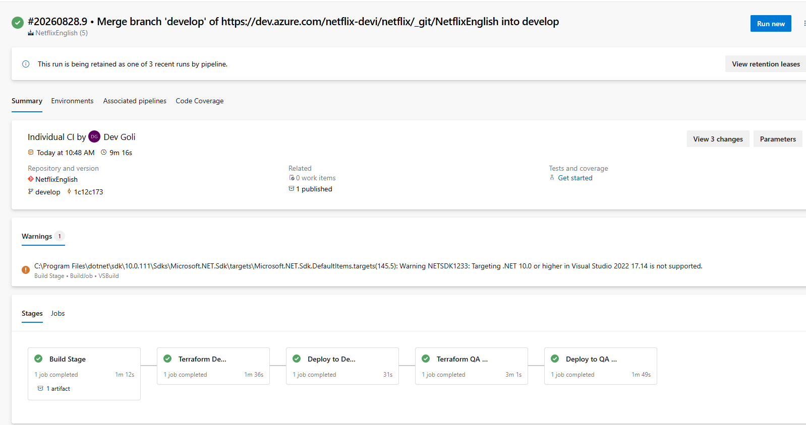

# Lab 05 — Terraform in a Multi-Stage CI/CD Pipeline

An ASP.NET Core app built once, then deployed to **dev** and **qa** Azure App
Services whose infrastructure is provisioned by Terraform — all from one Azure
Pipelines run.

**Concepts:** multi-stage pipelines · deployment jobs · environments ·
per-environment backend config · build-once-deploy-many

**Day:** 55 — the hardest lab so far

## Pipeline

```
Build ──► Terraform Dev ──► Deploy Dev ──► Terraform QA ──► Deploy QA
 1m12s        1m36s            31s            3m01s          1m49s
```

All five stages green in a single 9m 16s run:



## Deployed environments

Both App Services provisioned by Terraform and deployed to from the same build
artifact.

**Dev** — `nfenglishdevapp1.azurewebsites.net`


**QA** — `nfenglishqaapp1.azurewebsites.net`


Same artifact, two environments, separate infrastructure and separate state.

## What Terraform builds, per environment

```
resource group  nf-english-<env>rg
└── service plan   nf-english-asp-<env>   (Windows, B1)
    └── web app    nfenglish<env>app1
```

## State isolation without workspaces

Each environment has its own backend config, differing only in the blob `key`:

```hcl
# backend-dev.conf                    # backend-qa.conf
key = "dev.tfstate"                   key = "qa.tfstate"
```

```bash
terraform init -reconfigure -backend-config="backend-dev.conf"
```

```bash
terraform apply -var-file="dev.tfvars" -auto-approve
```

Different blob per environment = fully isolated state. This is the pattern
preferred over workspaces for real dev/qa/prod, because the environment is
**visible in a file** rather than hidden in invisible workspace selection.

> The backend config and the var file are independent choices. Pairing
> `backend-dev.conf` with `qa.tfvars` would write QA's resources into dev's
> state. Safe here because each pipeline stage hardcodes the pair on a fresh
> agent.

> **Note:** `azureSubscription` in the pipeline files is shown as
> `'<your-azure-service-connection>'`. In the real pipeline this is the name of
> an Azure Resource Manager **service connection** configured in Azure DevOps
> (Project Settings → Service connections), which holds the service principal
> credentials. The actual name embeds a subscription ID, so it is replaced here.

## Files

| File | Purpose |
|---|---|
| `azure-pipelines-2.yml` | the multi-stage pipeline |
| `azure-pipelines.yml` | the earlier build-only pipeline |
| `terraform/providers.tf` | provider + backend block |
| `terraform/resources.tf` | resource group, service plan, web app |
| `terraform/variables.tf` | inputs |
| `terraform/dev.tfvars`, `qa.tfvars` | per-environment values (names only, no secrets) |
| `terraform/backend-dev.conf`, `backend-qa.conf` | per-environment state location |

## What I learned

Three failures worth remembering, all diagnosed from the pipeline logs:

**Resources created in parallel that shouldn't be.** `resource_group_name = var.rgname`
passed a plain string, so Terraform saw no dependency and started the resource
group and service plan simultaneously. The RG took 24s; the service plan 404'd
instantly with `ResourceGroupNotFound`. Fixed by referencing
`azurerm_resource_group.resourcerg.name` instead. Two parallel `Creating...`
lines where you expect sequence is the signature.

**A green `terraform init` proves nothing about your working directory.** A bad
`cd` failed silently and init succeeded anyway — init in an empty directory is a
valid no-op. The error only appeared at `apply`.

**YAML that fails silently.** `steps:` indented under `pool:` instead of beside
it meant the build job ran zero tasks and reported success in 6 seconds. Azure
Pipelines ignores the misplaced key rather than erroring. A build that passes
suspiciously fast is the tell.

## Known improvements

- [ ] Add a **Prod** stage with a manual approval gate on the environment
- [ ] Replace `VSBuild`/`NuGetCommand`/`VSTest` with `DotNetCoreCLI@2` — the
      run warns `NETSDK1233: Targeting .NET 10.0 in Visual Studio 2022 is not
      supported`, which is this mismatch surfacing. Would also allow
      `ubuntu-latest` agents.
- [ ] Add `terraform plan -out=tfplan` and apply that saved plan, so apply runs
      exactly what was reviewed
- [ ] No tests in the pipeline — add an xUnit project
- [ ] `-auto-approve` on every environment; prod should require approval
- [ ] Provider pinned `>= 4.0` — a v5 release could break the config
      (`.terraform.lock.hcl` currently resolves to 5.2.0)
